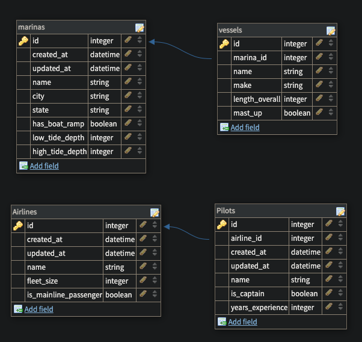

# Relational Rails

1. Relational Rails uses two examples (Airlines_to_Pilots and Marinas_to_Vessels)
to showcase **one-to-many relationships** in a **SQL** (structured query language)
database. Allows you to implement CRUD (create, read, update, destroy)
framework in a Ruby on Rails framework. The full project can be found on [GitHub](https://github.com/r-stemmle/relational_rails).

2. How to install it? Fork this repository and clone it to your local environment. For detailed instructions, please visit: [GitHub Docs: Fork A Repo](https://docs.github.com/en/github/getting-started-with-github/fork-a-repo).

3. Example usage
    This app is an exercise to demonstrate a parent and child relationship, as well as one to many relationship.  There is not a landing page.  The parents of the app are airlines and marinas.  The children are pilots and vessels, as in boats.  Enter “/<parent>” into the browser to begin using the app to see the functionality.  Functionality includes basic CRUD operations:
    see a list of parents
    * create a parent
    * create a child
    * see a list of children belonging to a parent
    * edit a parent
    * edit a child
    * delete a parent
    * delete a child

